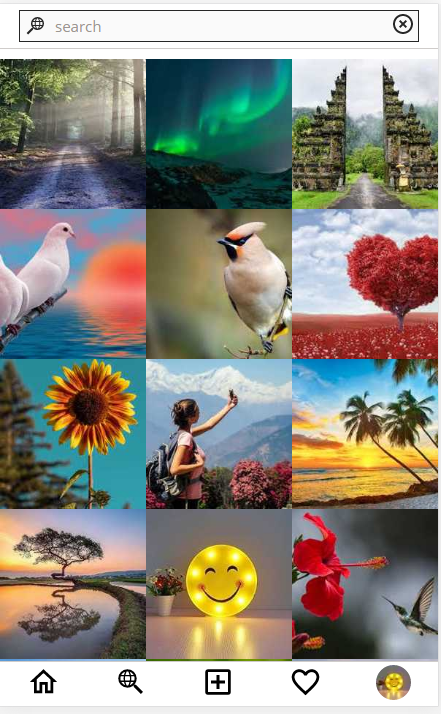

<p align="center">
  <h3 align="center">Instagram Clone</h3>

  <p align="center">
    <a href="https://github.com/iamtalwinder/instagram-clone/issues/new?assignees=&labels=&template=bug_report.md&title=">Report Bug</a>
    ·
    <a href="https://github.com/iamtalwinder/instagram-clone/issues/new?assignees=&labels=&template=feature_request.md&title=">Request Feature</a>
  </p>
</p>

<!-- TABLE OF CONTENTS -->
<details open="open">
  <summary>Table of Contents</summary>
  <ol>
    <li>
      <a href="#about-the-project">About The Project</a>
      <ul>
        <li><a href="#features">Features</a></li>
        <li><a href="#built-with">Built With</a></li>
        <li><a href="#built-with">Screenshots</a></li>
          <ul>
            <li><a href="#signin">Signin</a></li>
            <li><a href="#signup">Signup</a></li>
            <li><a href="#home">Home</a></li>
            <li><a href="#likes">Likes</a></li>
            <li><a href="#comments">Comments</a></li>
            <li><a href="#explore">Explore</a></li>
            <li><a href="#user-search">User Search</a></li>
            <li><a href="#new-post">New Post</a></li>
            <li><a href="#profile">Profile</a></li>
            <li><a href="#edit-profile">Edit Profile</a></li>
          </ul>
      </ul>
    </li>
    <li>
      <a href="#getting-started">Getting Started</a>
      <ul>
        <li><a href="#prerequisites">Prerequisites</a></li>
        <li><a href="#installation">Installation</a></li>
      </ul>
    </li>
    <li><a href="#roadmap">Roadmap</a></li>
    <li><a href="#contributing">Contributing</a></li>
    <li><a href="#license">License</a></li>
    <li><a href="#contact">Contact</a></li>
  </ol>
</details>

<!-- ABOUT THE PROJECT -->

## About The Project

This project is a bare minimum clone of [instagram](https://www.instagram.com/)

### Features

- [x] Upload post
- [x] Delete post
- [x] Like
- [x] Comment
- [x] Follow
- [x] Unfollow
- [x] Feeds
- [x] Explore
- [x] Search users
- [x] Edit profile
- [x] Login with Facebook
- [ ] Discover People
- [ ] Save post
- [ ] Activity
- [ ] Stories
- [ ] DM
- [ ] Share post
- [ ] Private Account
- [ ] Temporary Disable Account
- [ ] Block user

### Built With

- [Nodejs](https://nodejs.org/)
- [Express](https://expressjs.com/)
- [Mysql](https://www.mysql.com/)
- [React](https://reactjs.org/)

### Screenshots

#### Signin

<p align="center">
  
</p>

#### Signup

<p align="center">
  
</p>

#### Home

<p align="center">
  
</p>

#### Likes

<p align="center">
  
</p>

#### Comments

<p align="center">
  
</p>

#### Explore

<p align="center">
  
</p>

#### User Search

<p align="center">
  
</p>

#### New Post

<p align="center">
  
</p>

#### Profile

<p align="center">
  
</p>

#### Edit Profile

<p align="center">
  
</p>
<!-- GETTING STARTED -->

## Getting Started

To get a local copy up and running follow these simple steps.

### Prerequisites

Make sure you have these installed before moving on:

- [nodejs](https://nodejs.org/) v12.16.1 or up
- [npm](https://nodejs.org/) v6.13.4 or up
- [mysql](https://dev.mysql.com/downloads/installer/) v8.0.19 or up

### Installation

1. Clone the repo

   ```sh
   git clone https://github.com/iamtalwinder/instagram-clone.git
   ```

2. Register app on facebook (optional)

   If you want to login to your app with facebook you need to register it [here](https://developers.facebook.com/apps/).

   1. Create facebook developers account.
   2. Register you app.
   3. Save app id and app secret.

3. Setting up client

   1. Installing pakages

      Open terminal in client directory and run:

      ```sh
      npm install
      ```

   2. Creating `.env` file

      1. Create `.env` file in client directory
      2. Add following variables in it:

         ```
         REACT_APP_FACEBOOK_APP_ID=<your facebook app id>
         REACT_APP_FACEBOOK_REDIRECT_URI=http://localhost:3000
         ```

   3. Running client

      Open terminal in client directory and run:

      ```sh
      npm start
      ```

4. Setting up server

   1. Installing pakages

      Open terminal in server directory and run:

      ```sh
      npm install
      ```

   2. Setting up database

      #### With workbench

      1. Open workbench
      2. Login with root account
      3. Open [script.sql](server/script.sql) in workbench
      4. Press `ctrl + shift + enter`

      #### With terminal

      1. Open terminal
      2. Run
         ```sh
         mysql -u root -p
         ```
      3. Enter your password
      4. Run

         ```sh
         source <path to script.sql>
         ```

         Example:

         ```sh
         source D:/projects/instagram-clone/server/script.sql
         ```

      At this point you should have these:

      ```
      DATABASE: instagram_clone
      USER: instagram_clone
      USER_PASSWORD: instagram_clone
      ```

   3. Creating `.env` file

      1. Create `.env` file in server directory
      2. Add following variables in it:

         ```
         PORT=4000

         DB_HOST=localhost
         DB_USER=instagram_clone
         DB_PASSWORD=instagram_clone
         DB_NAME=instagram_clone

         SESSION_SECRET=dsakjnbbhvbcnsdafmsvajngvhcnmhvnsglngnnhgsdgh
         SESSION_COOKIE_NAME=USER_SID

         FACEBOOK_APP_ID=<your facebook app id>
         FACEBOOK_APP_SECRET=<your facebook app secret>
         FACEBOOK_REDIRECT_URI=http://localhost:3000/
         ```

   4. Running server

      Open terminal in server directory and run

      ```sh
      npm start
      ```

      or

      ```sh
      nodemon server.js
      ```

5. Running both server and client with one command

   Open terminal in server directory and run:

   ```sh
   npm run dev
   ```

   <!-- ROADMAP -->

## Roadmap

See the [open issues](https://github.com/iamtalwinder/instagram-clone/issues) for a list of proposed features (and known issues).

<!-- CONTRIBUTING -->

## Contributing

Contributions are what make the open source community such an amazing place to be learn, inspire, and create. Any contributions you make are **greatly appreciated**.

1. Fork the Project
2. Create your Feature Branch (`git checkout -b feature/AmazingFeature`)
3. Commit your Changes (`git commit -m 'Add some AmazingFeature'`)
4. Push to the Branch (`git push origin feature/AmazingFeature`)
5. Open a Pull Request

<!-- LICENSE -->

## License

Distributed under the MIT License. See [LICENSE](LICENSE) for more information.

<!-- CONTACT -->

## Contact

Talwinder Singh - [@iam_talwinder](https://twitter.com/iam_talwinder) - singhtalwinder790@gmail.com
